# iOS[Objective-C]知识整理
## 项目概述

我将陆续补充此文档的内容，方便知识点的检索
栈、堆、方法区？将之前整理在印象笔记中的笔记也重新梳理一遍并迁移到这里来！然后删除印象笔记，争取保留一份最好的笔记。
clang、runtime、多线程、网络、


## block

### 1、什么是block？

```apl
Block是将函数及其执行上下文封装起来的对象，因为block的结构体中含有isa指针，说明它是一个OC对象。

补充：我们可以通过查看Block的源码来对其进行分析。可以通过编译器命令【clang -rewrite-objc filename.m】查看编译之后的文件内容。
在终端terminal中cd到对应的文件，然后执行上述命令，就会在对应文件的同级目录中生成对应的.cpp文件。也就是一个C++文件。
最终可以看到block的结构体中包含有isa指针，这也能说明block是一个oc对象
```

### 2、什么是Block调用？

```apl
Block调用就是函数的调用。（同样可以查看包含Block的编译后的.cpp文件）
```

### 3、截获变量的特性是怎样实现的？

```apl
Block的一大特性是截获变量，那么系统关于截获变量的特性是怎样实现的？
分情况：不同变量的截获是不一样的
1、局部变量（声明在方法内）：基本数据类型和对象类型
2、静态局部变量
3、全局变量（声明在方法外）
4、静态全局变量

答：如下
对于基本数据类型的局部变量截获其值。
对于对象类型的局部变量连同所有权修饰符一起截获。
以指针形式截获局部静态变量。
不截获全局变量、静态全局变量。

使用【clang -rewrite-objc -fobjc-arc filename.m】命令（这里使用的命令与前面的命令多了一个参数-fobjc-arc）
```

### 4、__block修饰符的作用？

```apl
答：一般情况下，对被截获变量进行赋值操作时需要添加__block修饰符。「赋值并不等于使用」
如下两张图
```

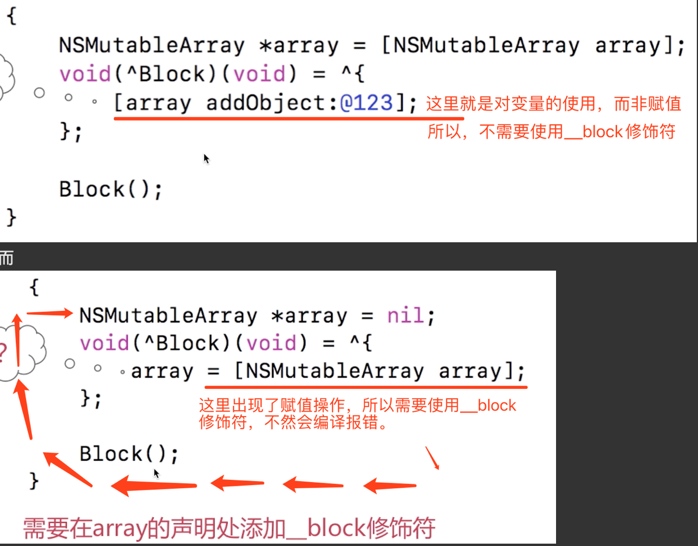

综上在Block中对变量进行赋值时：

对于局部变量的赋值(基本数据类型和对象类型)，需要使用__block修饰符。

对于静态局部变量、全局变量、静态全局变量的赋值，不需要使用__block修饰符。

__block修饰的变量最终变成了对象（即结构体）。

__block修饰的局部变量，在栈Block中还包含了一个__forwarding，它指向它自身(前提是它是栈上的Block)，当block方法体之后的代码对__block修饰的局部变量赋值时，

实际上是通过对象的__forwarding对起内容进行了修改。下详

### 5、Block的内存管理是怎样的？

Block有三种类型

_NSConcreteGlobalBlock：全局类型的Block
_NSConcreteStackBlock：栈上的Block
_NSConcreteMallocBlock：堆上的Block

对应不同类型的Block在内存上的分配情况：

栈Block 分配到栈上
堆Block 分配到堆上
全局Block 分配到已初始化数据区

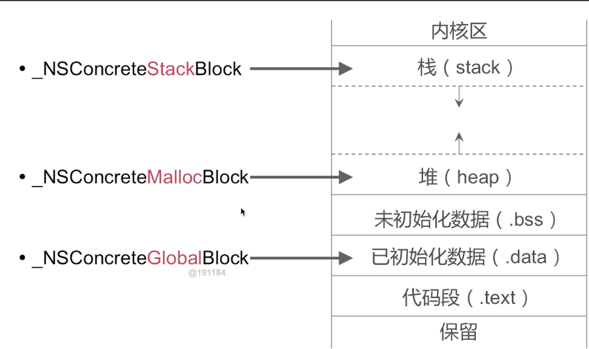

Block的copy操作（我们在何时需要对Block进行copy操作？）
栈   Block   在进行copy操作的时候，会在堆中复制一个同样的Block
全局Block   在进行copy操作的时候，什么也不会做
堆   Block   在进行copy操作的时候，其引用计数+1（如下图）

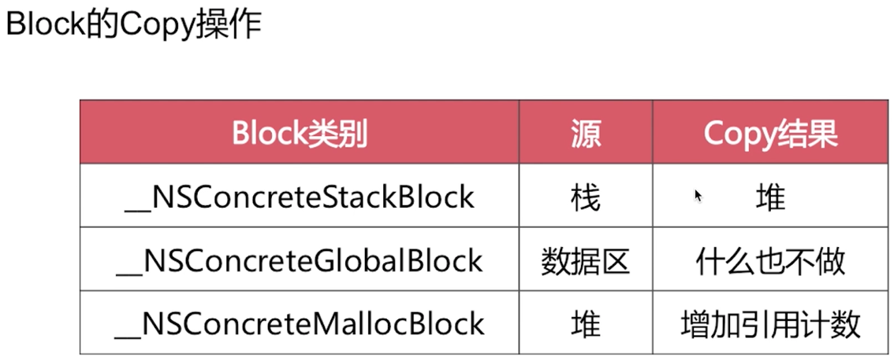

栈上Block被copy后的内存情况：

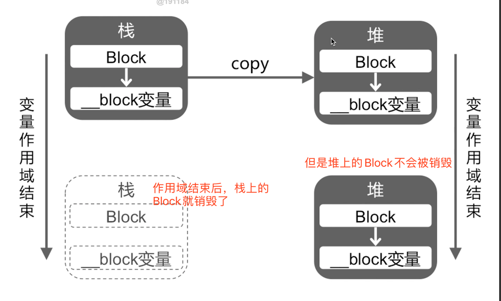

在mrc情况下是会引起内存泄漏的。
栈上__block变量的copy操作：如图：__
__解释：
当栈上的__block变量被copy操作之后，会复制一个Block到堆上。__
__栈上的__forwarding会指向堆Block的__block变量；
而堆上的__forwarding会指向其自身的__block变量；
这样无论你是在栈上调用__forwarding修改__block变量的值还是在堆上调用__forwarding修改__block的值，都会
修改到堆上面的__block的值。__
__如果栈block没有执行copy操作，那么修改__block的值时，此时Block只有栈Block，__forwarding指向自身的__block变量，就会修改
自身变量的值。
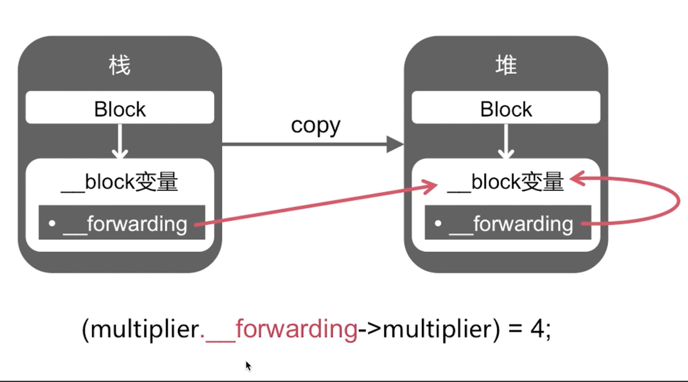

面试题如下：问result的值是多少？

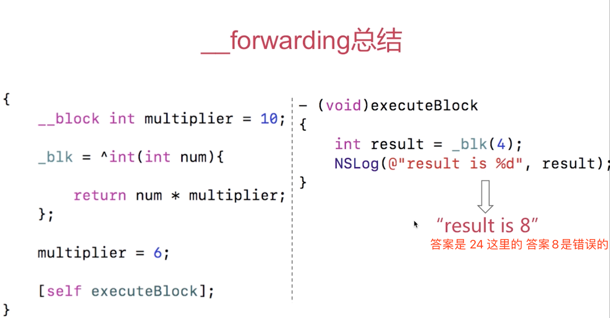

分析：

左边代码：
在栈上创建的局部变量通过__block修饰的 multiplier变量 实际上变成了一个对象，所以后面的multiplier=6;赋值，实际上不是对变量进行赋值。而是通过multiplier对象的__forwarding指针对其变量multiplier进行赋值。_blk变量是某个对象的成员变量。当对它进行赋值操作的时候实际上是会对它进行copy。那么这个Block就会复制到堆上。最后执行[self executeBlock];执行block。

左边的代码 
如果Block没有进行copy操作，那么multiplier=6;就是修改的栈上的Block的__block变量。__
__如果Block进行的copy操作(显然本题进行了copy)，那么multiplier=6;就是通过栈上的multiplier的__forwarding指针修改的堆上的Block的__block变量。

右边代码：
调用了堆上的Block，入参是4。此时Block中的__block变量使用的实际上是堆上的__block变量。左边代码的赋值操作multiplier=6;是堆堆上面__block变量的修改。所以这里的结果是4*6 == 24；__
forwarding存在的意义：
__如果对__block 变量不copy，操作的就是栈上的__block 变量；
如果发生了copy，无论操作的是栈上、还是堆上__block 变量，都是使用的堆上__block 变量。

### 6、Block的循环引用？

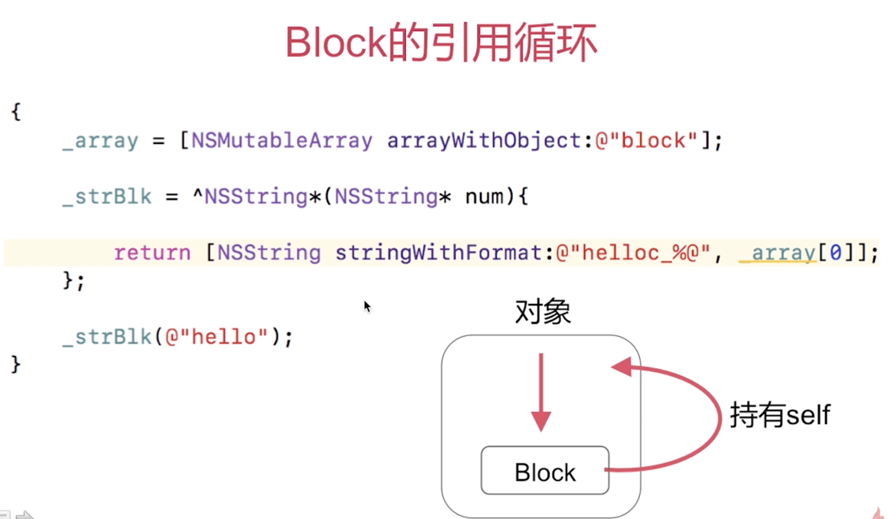

如上图，从Block截获变量的知识中知道，对于对象类型的局部变量连同所有权修饰符一起截获。这里的_array通常是用strong修饰的，所以在Block中也存在一个strong修饰的_array;这样就造成了一个循环引用。
解决方案：通过使用 __weak 关键字来解决。如下
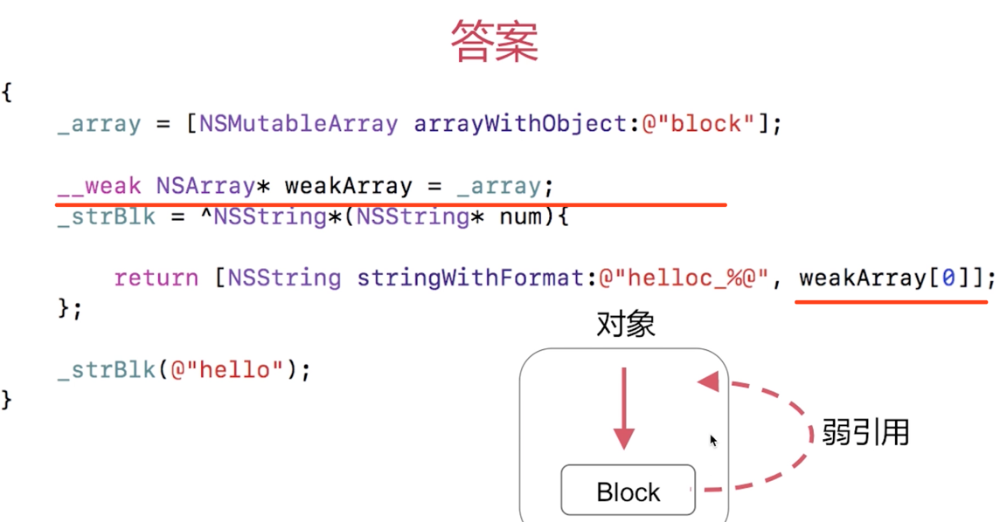

那么为什么通过使用__weak关键字能够避免循环引用呢？__
__还是截获变量相关的知识。由于对于对象类型的局部变量连同所有权修饰符一起截获。所以上面的__weak修饰的对象在Block中也是一个__weak修饰的对象，所以Block内部是一个弱引用的对象。

面试题如下：

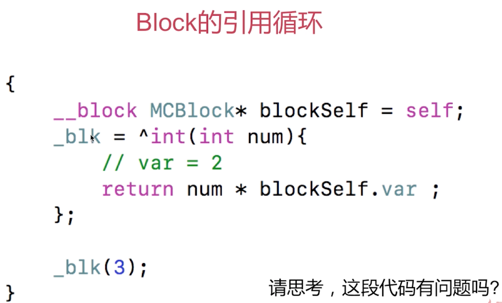

解答：
在MRC下不会产生循环引用。
在ARC下会产生循环引用，引起内存泄漏。
上图代码发生循环引用的情况如下图所示。

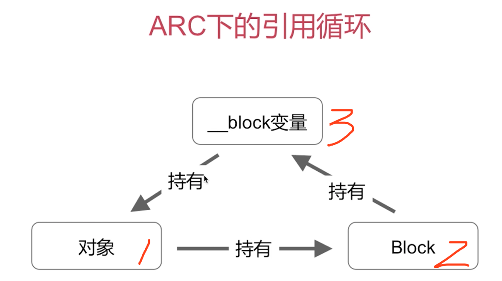

解决办法是通过断环的方式。比如断开__block变量对原对象的持有,就可以规避循环引用。具体操作如下：
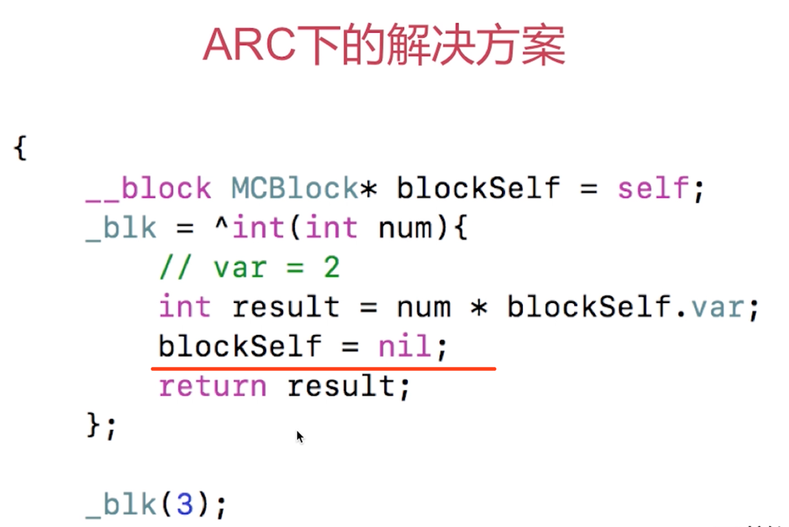

通过在执行Block的时候，使用完blockSelf之后，就将其置为nil，这样就达到了断环的效果。
但是这样做有一个弊端，就是如果我们不执行Block，那么这个循环引用的就会一直存在。
**补充：自己上网搜！****可以在掘金、简书、CSDN等平台上搜一些文章来继续深入学习相关内容**

ps.笔记来自我的印象笔记

补充参考：https://juejin.cn/post/6844904145283973127 【面试题+block原理】

