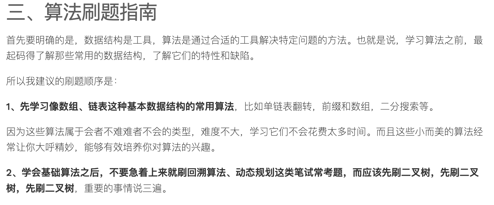
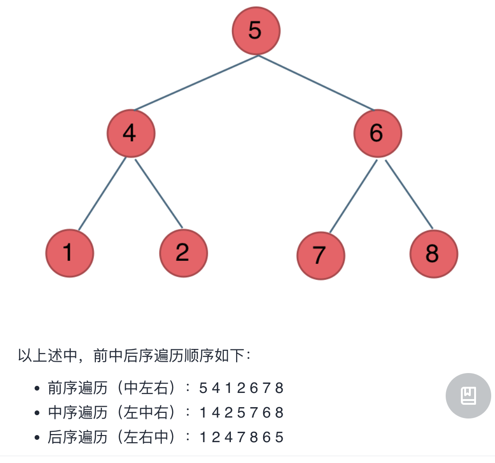

# 算法

复习的时候直接看题目，做不出来再看解题思路，以及自己先前的理解笔记，并且再次优化笔记。【2022-4-3】


笔记概括：
目前主要包含的算法题型有
1、前缀和：核心思想就是 提前算出前n项和的数组，然后利用S5-S2 = a3+a4+5 求出连续子数组相关题答案
**前缀和**思想，**前缀和**和**滑动窗口**会经常用在求**子数组和子串**问题上。这类题目的核心思想就是先计算前缀和，然后再用鱼后序的计算。有些比较难的题目，其实难点不在前缀和的构造，难在前缀和之外的一些变化，例如条件判断的理解和hash的理解。

6、滑动窗口

2、单调栈
3、双指针
4、BFS
建议从「二叉树」系列问题开始刷，结合框架思维，把树结构理解到位，然后再去看回溯、动规、分治等算法专题，对思路的理解就会更加深刻

5、DFS
7、并查集
8、二分

核心参考：https://labuladong.gitee.io/algo
参考目录：https://mp.weixin.qq.com/s/AWsL7G89RtaHyHjRPNJENA
学习总结：

```apl
1、先学习套路，然后在进行做题。
2、不会做的题不要一致浪费时间，leecode上有解题思路，可以仔细学习消化。如果始终无法理解，也不要浪费时间，先放一放，继续后面的任务，间隔一小段时间后再来看，可以继续学习相关内容，然后在来看不会的题。
3、对自己掌握的内容一定要做好文档，后面还可以录制视频「前提是文档准备得足够充分」
4、通常做过的题目，尤其是比较难的题目，隔一段时间后还要在做一次，记得写下解题的思路
```

## 1、前缀和(前N项和)

参考文章：https://mp.weixin.qq.com/s/r-6Yfp2qn_x8nKJMVirdyQ

```apl
来自参考文章中的描述：
前缀和其实我们很早之前就了解过的，我们求数列的和时，Sn = a1+a2+a3+...an; 此时Sn就是数列的前 n 项和。例 S5 = a1 + a2 +  a3 + a4 + a5; S2 = a1 + a2。所以我们完全可以通过 S5-S2 得到 a3+a4+a5 的值，这个过程就和我们做题用到的前缀和思想类似。我们的前缀和数组里保存的就是前 n 项的和

核心思想（我的理解，其实是一个意思）：
前缀和的意思就是：一个数列的总和
我们在做数组类求和的算法题时，可以对已知数组求出数组的总和，即这里的前缀和
比如数组  S5={a1+a2+a3+a4+a5};
由于 S5 = a1+a2+a3+a4+a5;  S2 = a1+a2;
由于 S5-S2 = a3+a4+a5 注意！这里的a3~a5就是一个连续的子数组
我们可以得出这样的结论。  Sx - Sy = a(y+1)+...+ax;(x>y),比如上面的S5-S2的例子
利用上面的规律我们可以对很多类似的数组题进行求解
```

了解以上思想，对下列类型算法题的解答将会变得更容易理解，其实也并不简单。关键还是理解+实践
必须在牛客网or力扣上实践，否则无法检验。

注意：关于下列算法的详细需求，自行移步到leecode查看，思路可以参考顶部的 前缀和文章

### 1、leecode 724 寻找数组的中心下标（简单）

这个题严格来说并没有用到前缀和思想，直接做也能做出来

```c++
#include<iostream>
#include<vector>
using namespace std;

int pivotIndex(vector<int>& nums) {
    int sum = 0;
    int leftSum = 0;
    for(int i = 0; i < nums.size(); i++){
      	sum += nums[i];
    }
    //根据中心索引的定义----> leftSum + nums[centerIndex] + rightSum = sum
    //所以有 sum - nums[centerIndex] = leftSum * 2
    for(int i = 0; i<nums.size(); i++){
        if(sum - nums[i] == leftSum*2){//细节1：不要用除法，因为有无法整除的情况，会算错
            return i;
        }
        leftSum += nums[i];//细节2：这行代码是否可以放在for循环开头？
        /*
        答案是不可以，必须放在for循环的末尾，因为我们要求的i是一个中心索引
      	而leftSum的值是前n项和，这里的n+1才==i，如果将求leftSum的计算放在for循环开头
        那leftSum的值是前i项和了，我们无法求出预期结果。关键就在于这个i
        实际上for中进入if时的leftSum是上一次循环的求和，所以上一次的i和当前的i差1个偏移量
        */
    }
    return -1;
}

int main(){
    vector<int>intArr;
    intArr.push_back(1);
    intArr.push_back(2);
    intArr.push_back(3);
    intArr.push_back(4);
    intArr.push_back(5);
    intArr.push_back(5);
    intArr.push_back(5);
    cout <<pivotIndex(intArr)<<endl;
    return 0;
}
```

### 2、leecode 1 两数之和（简单）

本题并没有用到前缀和思想
我的疑问？这两个数在数组中必须是连续的吗？题目没有暗示，那么可以不连续？
注意题目的意思【你可以假设每种输入只会对应一个答案。但是，数组中同一个元素在答案里不能重复出现。】
首先target=nums[i]+nums[j];只存在唯一的答案，并且nums[i] != nums[j]; 所以这两个数在数组中可以不连续

```c++
#include<iostream>
#include<vector>
using namespace std;

vector<int> twoSum(vector<int>& nums, int target) {
        vector<int>targetNums;
        for(int i = 0; i < nums.size(); i ++){
            for(int j = i+1; j < nums.size(); j ++){
                if(nums[i] + nums[j] == target){
                    targetNums.push_back(i);
                    targetNums.push_back(j);
                    return targetNums;
                }
            }
        }
        return targetNums;
    }

int main(){
    vector<int>intArr;
    intArr.push_back(1);
    intArr.push_back(2);
    intArr.push_back(3);
    vector<int>result = twoSum(intArr, 5);
    cout <<"["<<result[0]<<"],["<<result[1]<<"]"<<endl;
    return 0;
}
```

### 3、[lecode 1588. 所有奇数长度子数组的和](https://leetcode-cn.com/problems/sum-of-all-odd-length-subarrays/)

```c++
#include<iostream>
#include<vector>
using namespace std;

int sumOddLengthSubarrays(vector<int>& arr) {
    int result = 0;//注意 一定要初始化，不然结果会错误	
    vector<int>presum;
    presum.push_back(0);//前缀和默认值
    for (int i = 0; i < arr.size(); i++) {
        presum.push_back(presum[i]+arr[i]);//构造前缀和
    }
    for (int i = 0; i < presum.size(); i++) {//注意 这里用的是presum.size() 而不是 arr.size()
        for (int j = i+1; j < presum.size(); j++) {
            if ((j-i)%2 != 0) {
                result += presum[j] - presum[i];
            }
        }
    }
    return result;
}

int main(){
    vector<int>arr;
    arr.push_back(1);
    arr.push_back(4);
    arr.push_back(2);
    arr.push_back(5);
    arr.push_back(3);
    cout << sumOddLengthSubarrays(arr) << endl;
}
```


### 3、leecode 560 和为K的子数组「中等」

本题和 [930. 和相同的二元子数组](https://leetcode-cn.com/problems/binary-subarrays-with-sum/) 题目几乎一模一样。

暴力解法

```c++
#include<iostream>
#include<vector>
using namespace std;

int sumKSubArray(vector<int>&nums, int k){//暴力解法【时间复杂度 O(n)方】
    //首先计算前缀和数组
     vector<int> presum;
     presum.push_back(0);
     for(int i = 0; i < nums.size(); i ++) {
         presum.push_back(presum[i]+nums[i]);
     }
     //根据前缀和思想 求出满足条件的子数组个数
     int count = 0;
     for(int i = 0; i < presum.size(); i++) {
         for(int j = i +1; j < presum.size(); j++) {
             if(presum[j] - presum[i] == k) {
                 count ++;
             }
         }
     }
     return count;
}

int main(){
    vector<int>intArr;
    intArr.push_back(1);
    intArr.push_back(-1);
    intArr.push_back(0);
    cout <<sumKSubArray(intArr, 0)<<endl;
    return 0;
}
```

hash+前缀和 解法 这个题并没有完全搞懂！
突然想起来我有买书。。。看看书里有没有讲明白！【2022-4-3】~~~书本并没有嚼碎了告诉我，还是不太理解。

```c++
#include<iostream>
#include<vector>
#include<map>
using namespace std;

int sumKSubArray(vector<int>&nums, int k){
    int count = 0;
    map<int, int> mapPresum;
    mapPresum[0] = 1;//这里的值是为了覆盖k=0的情况
    int presum = 0;
    for(int i = 0; i < nums.size(); i ++){
        presum += nums[i];
        if (mapPresum[presum-k]) {//这里也不是很好理解
            count += mapPresum[presum -k];//这里也不是很好理解
        }
        //下面的if else 其实可以简写成 mapPresum[presum]++ 因为无论怎样都会+1；
        //注意下面的代码只能写在下面，不能写在if (mapPresum[presum-k])之前
        //为什么呢？
        if (mapPresum[presum]) {
            mapPresum[presum] += 1;//注意这里是 += 1;
        } else {
            mapPresum[presum] = 1;
        }
    }
    //本题和 leecode 统计优美子数组 题目很像，建议一同处理
    return count;
}

int main(){
    vector<int>intArr;
    intArr.push_back(1);
    intArr.push_back(-1);
    intArr.push_back(0);
    cout <<sumKSubArray(intArr, 0)<<endl;
    return 0;
}

```

### 4、leecode 1248 统计优美子数组「中等」

这里不太好理解的地方是 前缀和求的是奇数个数的和，而且也是结合hash来做的

```c++
int numberOfSubarrays(vector<int>& nums, int k) {
        int count = 0;
        //先统计奇数个数，相当于前缀和
        int jiNum = 0;
        map<int, int>mapJi;
        mapJi[0] = 1;
        for (int i = 0; i < nums.size(); i++) {
            jiNum += nums[i] & 1;  //xxxx & 0001--> 如果是 奇数&1==1，否则==0
            if (mapJi[jiNum - k]) {//注意这里的 key=jiNum-k
                count += mapJi[jiNum -k];//注意这里的 key=jiNum-k
            }
            if (mapJi[jiNum]) {
                mapJi[jiNum] += 1;//注意 这里是 +=1;
            } else {
                mapJi[jiNum] = 1;
            }
        }
    return count;
}
```

### 5、[lecode 1310. 子数组异或查询](https://leetcode-cn.com/problems/xor-queries-of-a-subarray/)「中等」

暴力解法->超出了时间限制
这里我的思路是：先对queries数组遍历，取出它的每一个元素，然后在根据元素的第一位和第二位进行遍历arr中的元素，对其进行异或运算。

```c++
vector<int> xorQueries(vector<int>& arr, vector<vector<int>>& queries) {
    vector<int>xorVec;
    for(int i = 0; i< queries.size(); i++){
        vector<int>subQuery = queries[i];
        int xora = 0;
        for(int j = subQuery[0]; j <= subQuery[1]; j++){
            if (subQuery[0] == subQuery[1]) {//根据题目要求当开始位置和结束为止相同，则返回
                xorVec.push_back(arr[subQuery[0]]);
                break;
            }
            if (j == subQuery[0]) {//将第一个元素放入xora中，等待异或运算
                xora = arr[subQuery[0]];
            } else {//异或运算
                xora ^= arr[j];
            }
            if(j == subQuery[1]){//当计算到末尾结束后将结果放到结果数组中
                xorVec.push_back(xora);
            }
        }
    }
    return xorVec;
}

下面是参考网上的答案实现的代码，时间复杂度一致，但更加简洁
vector<int> xorQueries(vector<int>& arr, vector<vector<int>>& queries) {
      //首先创建一个整型数组，用于返回结果，它的长度==queries的长度
      vector<int>resultVec;
      //遍历queries数组
      for(int i = 0; i < queries.size(); i++){
          //获取当前的queries子数组
          vector<int>subQue = queries[i];
          int r = 0;//用于存放当前queries子数组范围内的异或和
          //遍历queries子数组的范围，求 异或和
          for(int j = subQue[0]; j <= subQue[1]; j++){
            //当 subQue[0]==subQue[1]时，r = 0 ^ arr[j]-->==arr[j]
            //因为 0^任何数 == 任何数
              r = r ^ arr[j];
          }
          resultVec.push_back(r);
      }
      return resultVec;
  }
```

更优解：前缀和思想
这里的前缀和，实际上是前n项做异或后的结果，所以可以得到：xors[i]=arr[0]⊕…⊕*arr*[*i*−1]
对于查询[left,right](left<=right),用Q(left,right)表示该查询的结果。
当left=0时，Q(left,right) = xors[right+1];
当left>0时，Q(left,right)的计算如下：
Q(left,right) = arr[left]⊕...⊕arr[right]
//下一这行的等式是凑出来的因为a⊕a⊕b=b，这一行的左边两个arr[0]⊕...⊕[left-1]异或就得0
= (arr[0]⊕...⊕[left-1])⊕(arr[0]⊕...⊕arr[left-1])⊕(arr[left]⊕...⊕arr[right])
//下一行的右边就是上一行的右边两个大项异或的合并
= (arr[0]⊕...⊕[left-1])⊕(arr[0]⊕...⊕arr[right])
//由于xors[i]=arr[0]⊕...⊕arr[i−1],于是xors[left]=arr[0]⊕...⊕arr[left−1]
//于是xors[right+1]=arr[0]⊕...⊕arr[right]
//于是有
= xors[left]⊕xors[right+1]
所以，我们先求出前缀和，然后根据Q(left,right) = arr[left]⊕...⊕arr[right]=xors[left]⊕xors[right+1]，求出想要的结果即可

```c++
vector<int> xorQueries2(vector<int>& arr, vector<vector<int>>& queries) {
    size_t n = arr.size();//获取arr长度
    vector<int> xors(n + 1);//注意 这里一定要提前指定大小，开辟空间，否则下面会crash
    //构造前缀和，这里是前n项做异或结果的数组
    for (int i = 0; i < n; i++) {
        xors[i + 1] = xors[i] ^ arr[i];
    }
    size_t m = queries.size();
    vector<int> ans(m);//注意 这里一定要提前指定大小，开辟空间，否则下面会crash
    for (int i = 0; i < m; i++) {
        //这里其实就是利用前缀公式求出来的结果，所以这行代码很关键，它贯穿了全部代码的来龙去脉
        ans[i] = xors[queries[i][0]] ^ xors[queries[i][1] + 1];
    }
    return ans;
}
```

### 6、leecode 974 和可被K整除的子数组「中等」

```c++
没思路，也没看懂。。。2022-4-4
```

### 7、[1893. 检查是否区域内所有整数都被覆盖](https://leetcode-cn.com/problems/check-if-all-the-integers-in-a-range-are-covered/)「简单」

```c++
这道题用前缀和不知道怎么做？？？ leecode上的写法是二分法，也有暴力破解的
```

### 8、leecode 523 连续的子数组和「中等」

```c++
不会
```

### 9、1738. 找出第 K 大的异或坐标值

这个题先放一放，感觉比较难。leecode上有解题思路，后面再做「2022-2-3-pm」

### 10、[1177. 构建回文串检测](https://leetcode-cn.com/problems/can-make-palindrome-from-substring/)

这个题先放一放，感觉比较难。leecode上有解题思路，后面再做「2022-2-3-21:19」

---


## 2、单调栈

参考文章：https://mp.weixin.qq.com/s/Y2QZZ-coEYZ6ItDRyrdwVw
参考文章：https://labuladong.gitee.io/algo/2/20/51/

```apl
核心思想
栈（stack）是很简单的一种数据结构，先进后出的逻辑顺序，符合某些问题的特点，比如说函数调用栈。
单调栈实际上就是栈，只是利用了一些巧妙的逻辑，使得每次新元素入栈后，栈内的元素都保持有序（单调递增或单调递减）

```

### 1、[剑指 Offer 59 - II. 队列的最大值](https://leetcode-cn.com/problems/dui-lie-de-zui-da-zhi-lcof/)「中等」

请定义一个队列并实现函数 max_value 得到队列里的最大值，要求函数max_value、push_back 和 pop_front 的均摊时间复杂度都是O(1)。

若队列为空，pop_front 和 max_value 需要返回 -1

示例 1：

输入: 
["MaxQueue","push_back","push_back","max_value","pop_front","max_value"]
[[],[1],[2],[],[],[]]
输出: [null,null,null,2,1,2]
示例 2：

输入: 
["MaxQueue","pop_front","max_value"]
[[],[],[]]
输出: [null,-1,-1]

```c++
首先解释一下题目意思：
输入: 
["MaxQueue","push_back","push_back","max_value","pop_front","max_value"]
[[],[1],[2],[],[],[]]
输出: [null,null,null,2,1,2]

说明：
null：定义队列，输入为[],不需要入参，不需要返回值，所以输出null
null：入队操作，不需要返回值，将元素1入队，返回null
null：入队操作，不需要返回值，将元素2入队，返回null
2:max_value，返回最大值，输入为[]，不需要入参，所以返回2
1:pop_front，出队操作，1先入队所以先出队1
2:max_value,返回最大值，输入为[]，不需要入参，所以返回2「？？？获取最大值，并不意味着获取的值要出队，所以这里还会返回2」

大致思路：双向队列左边是种放最大的元素，入队的时候从右边入队，如果入队元素比右边元素大，右边元素就要出队。这样每次获取最大元素的时候，从双向队列左边获取即可。
  
详细思路：构造两个队列，一个单项队列q；一个双向队列d，单项队列无条件的入队、出队、双向队列入队时要保证左边元素始终是最大的，出队时要和单项队列一起出队。
max_value，如果队列为空就返回-1，否则返回双向队列左边的元素
push_back，在双向队列入队时，从右边入队，要保证入队元素比右边的元素大，如果右边的元素比入队元素小，则将右边元素出队，直到满足条件。这样就能保证双向队列的最左边是最大元素
pop_front，出队时，如果单项队列为空就返回-1，如果两个队列左边元素相等就都出队，否则只队q出队
  
#include <queue>
#include <deque>
class MaxQueue {
    queue<int>q;//单向队列
    deque<int>d;//双向队列
public:
    MaxQueue(){}
    
    int max_value(){
        if (d.empty()) {
            return -1;
        }
        return d.front();//返回最左边的元素？
    }
    
    void push_back(int value) {
        //循环 队列不能为空 且 队列右边的第一个元素 < value
        while (!d.empty() && d.back() < value) {
            d.pop_back();//将右边的第一个元素出队
        }
        d.push_back(value);//入队
        q.push(value);//单向队列入队
    }
    
    int pop_front() {
        if (q.empty()) {
            return -1;
        }
        int ans = q.front();//q出队左边
        if (ans == d.front()) {
            d.pop_front();//如果d左边第一个元素==q左边出队的元素，d左边也出队
        }
        q.pop();//因为q是单向队列 所以直接pop就出队了
        return ans;
    }
};  

```

### 2、[剑指 Offer 59 - I. 滑动窗口的最大值](https://leetcode-cn.com/problems/hua-dong-chuang-kou-de-zui-da-zhi-lcof/)「困难」

这道题的难度是[困难]，暂时不做了。目前只做[简单]和[中等]

### 3、[155. 最小栈](https://leetcode-cn.com/problems/min-stack/)「简单」

注意！这里用的数据结构是栈，而不是队列
思路：用一个数据栈来放默认操作的一些数据，用一个辅助栈来存放栈顶始终都是最小值的数据

```c++
#include<stack>
using namespace std;//注意这里的命名空间，否则下面的stack不能直接声明

class MinStack {
    stack<int>x_stack;//这是数据栈，即原本的数据处理栈
    stack<int>min_stack;//这是一个辅助栈，栈顶为最小值
    public:
    MinStack(){
        min_stack.push(INT_MAX);//为什么要放一个最大值到辅助栈中？
        //因为第一次push的时候 min_stack.top() 要有值，否则会crash，当然也可以自己做判断，这里就不用push了
    }
    
    void pop(){
        x_stack.pop();
        min_stack.pop();
    }
    
    void push(int x){
        x_stack.push(x);
        min_stack.push(min(min_stack.top(), x));//push的原属要和原站定元素比较，叫最小值入栈
        //当top<x时，岂不是会遇到重复的多个元素被入栈？是的，因为当重复的时候，说明x_stack中也有重复的最小值
    }
    
    int getMin(){
        return min_stack.top();
    }
    
    int top(){
        return x_stack.top();
    }
};
```

### 4、[496. 下一个更大元素 I](https://leetcode-cn.com/problems/next-greater-element-i/)「简单」

nums1 中数字 x 的 下一个更大元素 是指 x 在 nums2 中对应位置 右侧 的 第一个 比 x 大的元素。
给你两个 没有重复元素 的数组 nums1 和 nums2 ，下标从 0 开始计数，其中nums1 是 nums2 的子集。
对于每个 0 <= i < nums1.length ，找出满足 nums1[i] == nums2[j] 的下标 j ，并且在 nums2 确定 nums2[j] 的 下一个更大元素 。如果不存在下一个更大元素，那么本次查询的答案是 -1 。

返回一个长度为 nums1.length 的数组 ans 作为答案，满足 ans[i] 是如上所述的 下一个更大元素 。

示例 1：

输入：nums1 = [4,1,2], nums2 = [1,3,4,2].
输出：[-1,3,-1]
解释：nums1 中每个值的下一个更大元素如下所述：

- 4 ，用加粗斜体标识，nums2 = [1,3,4,2]。不存在下一个更大元素，所以答案是 -1 。
- 1 ，用加粗斜体标识，nums2 = [1,3,4,2]。下一个更大元素是 3 。
- 2 ，用加粗斜体标识，nums2 = [1,3,4,2]。不存在下一个更大元素，所以答案是 -1 。

```c++
思路：题目说nums1是nums2的子集，并不是说nums1是nums2的子数组，也弄错了!
意思是我们要遍历nums1中的每一个元素，并且找到它在nums2中对应的位置，然后找出它的下一个更大的元素作为返回值，如果不存在则返回-1

下面是我的思路后的解题代码，缺点是三层嵌套，通常不会出现完全遍历的情况，因为内循环下标不是起始点
由于是简单题，后面在考虑更优解「2022-2-4」
vector<int> nextGreaterElement(vector<int>& nums1, vector<int>& nums2) {
        vector<int>result;
        for(int i = 0; i < nums1.size(); i++){
            int nums1E = nums1[i];
            for(int j = 0; j < nums2.size(); j++){
                if(nums1E == nums2[j]){
                    if (j+1 < nums2.size()) {//存在下一个元素
                        for(int k = j+1; k < nums2.size(); k++){
                            if(nums2[k] > nums1E){//找到下一个更大元素
                                result.push_back(nums2[k]);
                                break;
                            }
                            if(nums2.size() == k+1){//没有找到
                                result.push_back(-1);
                            }
                        }
                    } else {//不存在下一个元素
                        result.push_back(-1);//不存在下一个更大元素
                    }
                }
            }
        }
        return result;
}
```

更优解 from:https://labuladong.gitee.io/algo/2/20/51/

```c++
vector<int> nextGreaterElement(vector<int>& nums) {
    vector<int> res(nums.size()); // 存放答案的数组
    stack<int> s;
    // 倒着往栈里放
    for (int i = nums.size() - 1; i >= 0; i--) {
        // 判定个子高矮
        while (!s.empty() && s.top() <= nums[i]) {
            // 矮个起开，反正也被挡着了。。。
            s.pop();
        }
        // nums[i] 身后的 next great number
        res[i] = s.empty() ? -1 : s.top();
        s.push(nums[i]);
    }
    return res;
}
```


### 5、[1475. 商品折扣后的最终价格](https://leetcode-cn.com/problems/final-prices-with-a-special-discount-in-a-shop/)「简单」

给你一个数组 prices ，其中 prices[i] 是商店里第 i 件商品的价格。

商店里正在进行促销活动，如果你要买第 i 件商品，那么你可以得到与 prices[j] 相等的折扣，其中 j 是满足 j > i 且 prices[j] <= prices[i] 的 最小下标 ，如果没有满足条件的 j ，你将没有任何折扣。
请你返回一个数组，数组中第 i 个元素是折扣后你购买商品 i 最终需要支付的价格。

示例 1：

输入：prices = [8,4,6,2,3]
输出：[4,2,4,2,3]
解释：
商品 0 的价格为 price[0]=8 ，你将得到 prices[1]=4 的折扣，所以最终价格为 8 - 4 = 4 。
商品 1 的价格为 price[1]=4 ，你将得到 prices[3]=2 的折扣，所以最终价格为 4 - 2 = 2 。
商品 2 的价格为 price[2]=6 ，你将得到 prices[3]=2 的折扣，所以最终价格为 6 - 2 = 4 。
商品 3 和 4 都没有折扣。

```c++
思路：题目的大概意思是数组中商品的折扣价格=它自身价格与“下一件”价格<=当前商品价格做的差
所以折扣的价格最低可以为0，如果不存在下一件商品或者没有价格比当前商品更低或相等的商品，则当前商品无折扣
由于是简单题，这里暂时不处理更优解
vector<int> finalPrices(vector<int>& prices) {
    vector<int>resultVec;
    for(int i = 0; i < prices.size(); i++){
        int cuPrice = prices[i];
        if (i == prices.size()-1) {
            resultVec.push_back(cuPrice);
            break;
        }
        for(int j = i+1; j< prices.size(); j++){
            if(cuPrice >= prices[j]){//注意这里是 >= 折扣后的价格最低可以为0
                resultVec.push_back(cuPrice-prices[j]);
                break;
            }
            if(j == prices.size()-1){//判断到最后一个元素
                resultVec.push_back(cuPrice);//无折扣
                break;
            }
        }
    }
    return resultVec;
}
```

### 6、[739. 每日温度](https://leetcode-cn.com/problems/daily-temperatures/)「中等」

```c++
由于for循环嵌套的原因，下面的解法超出时间复杂度限制了
vector<int> dailyTemperatures(vector<int>& temperatures) {
      vector<int>resultVec;
      for(int i = 0; i <temperatures.size(); i++){
          int cuT = temperatures[i];
          if(i == temperatures.size()-1){
              resultVec.push_back(0);
              break;
          }
          for(int j = i+1; j < temperatures.size(); j++){
              if(cuT < temperatures[j]){
                  resultVec.push_back(j-i);
                  break;
              }
              if(j == temperatures.size()-1){
                  resultVec.push_back(0);
                  break;
              }
          }
      }
      return resultVec;
}
```

更优解：from：https://labuladong.gitee.io/algo/2/20/51/

```c++
//下面的解法是从labuladong资源找到的，这里逆向遍历不是很好理解
#include<vector>
#include <stack>
#include<iostream>
using namespace std;
//两个巧妙的地方1:栈里放索引 2:逆序遍历，因为这样出栈时的顺序就和数组一致了
vector<int>getNextGreater(vector<int>&T){
    vector<int>res(T.size());
    stack<int>s;
    for (int i = T.size()-1; i>=0; i--) {//注意！这里是反向遍历
        while (!s.empty() && T[s.top()] <= T[i]) {
            s.pop();
        }
        res[i] = s.empty()?0:(s.top()-i);//得到索引间距
        s.push(i);//将索引入栈，而不是元素
    }
    return res;
}

//正向遍历求解，解法来自leecode 
//参考：https://leetcode-cn.com/problems/daily-temperatures/solution/dong-hua-yan-shi-dan-diao-zhan-739mei-ri-iita/
//需要注意的是while中res赋值的这行代码
vector<int> dailyTemperatures(vector<int>& temperatures) {
    vector<int>res(temperatures.size());
    stack<int>s;
    for (int i = 0; i < temperatures.size(); i++) {
        while(!s.empty() && temperatures[i] > temperatures[s.top()]){
            int prevIndex = s.top();//取出栈中保存的索引
            res[prevIndex] = i-prevIndex;//注意这一行！给对应索引下的元素求值
            s.pop();
        }
        s.push(i);
    }
    return res;
}
```

### 7、[1504. 统计全 1 子矩形](https://leetcode-cn.com/problems/count-submatrices-with-all-ones/)「中等」

明白题目的意思，但是做不出来，leecode上有解题思路，目前看不懂，暂时先跳过吧。2022-02-05

### 8、[907. 子数组的最小值之和](https://leetcode-cn.com/problems/sum-of-subarray-minimums/)「中等」

明白题目的意思，但是做不出来，leecode上有解题思路，目前看不懂，暂时先跳过吧。2022-02-06

---

## 3、双指针

参考文章：https://mp.weixin.qq.com/s/C4ZFwyJThBJdyqbNo87isQ
参考文章：https://labuladong.gitee.io/algo/2/21/59/

```apl
核心思想
先掌握C++的链表数据结构吧，怎么使用都不会，还写个锤子算法
```

### 1、[141. 环形链表](https://leetcode-cn.com/problems/linked-list-cycle/)「简单」

题目意思就是给你一个单链表，判断它是否包含环
下面的方法并没有使用到双指针

```c++
#include<iostream>
#include <map>
#include <unordered_set>
using namespace std;

//C++里面应该是没有默认的链表结构，下面的struct是需要自己创建的，这里创建的结构体是leecode帮我们创建的。所以可以不用管它，在hasCycle函数中直接使用它就行
struct ListNode {
    int val;
    ListNode *next;
    ListNode(int x) : val(x), next(NULL){}
};

bool hasCycle(ListNode *head) {
    unordered_set<ListNode*> seen;//注意这里定义了一个无序集合，需要导入相应头文件 
    while (head != nullptr) {
        if (seen.count(head)) {//如果集合中有这个head，那么就说明有环
            return true;//这里的思路很简单，就是用集合记录每一个head的遍历情况
          //下面会记录(insert)当前head的遍历，下一次再次if判断时，如果成环，就会进入if 返回true即可
          //如果没有成环，将在最后一个head被insert之后，结束whiel
        }
        seen.insert(head);
        head = head->next;
    }
    return false;
}
//这里感觉用map来替换unordered_set 也是可以的，但是我替换后一直报错，后面再试试
```

使用双指针求解
思路：在循环中用两个指针来遍历，一个慢指针slow，一个快指针，当存在环时，快指针会和慢指针相遇，相遇则返回true，不相遇，则返回false。但是利用双指针求解超出leecode时间限制了

```c++
struct ListNode {
    int val;
    ListNode *next;
    ListNode(int x) : val(x), next(NULL){}
};

//这里的方法虽然能算出来，但是时间复杂度超限了
bool hasCycle(ListNode *head) {
    ListNode *fast = nullptr, *slow = nullptr;
    while(head != nullptr){
        fast = head->next->next;
        slow = head->next;
        if (fast == slow) {//why 判断要放在下面，放在while开头处不对
            return true;
        }
    }
    return false;
}
```

### 2、[142. 环形链表 II](https://leetcode-cn.com/problems/linked-list-cycle-ii/)「中等」

下面的题没有用到双指针，感觉双指针不台适合这个题，双指针做起来不太好理解

```c++
思路很简单，利用hash，记录遍历到的节点，当再次遍历到第一个已遍历过的节点，则说明该节点是环的起始位置
#include<iostream>
#include <unordered_set>
using namespace std;

struct ListNode {
    int val;
    ListNode *next;
    ListNode(int x) : val(x), next(NULL) {}
};

ListNode *detectCycle(ListNode *head) {
    unordered_set<ListNode *> visited;
    while (head != nullptr) {
        if (visited.count(head)) {//注意这行代码
            return head;
        }
        visited.insert(head);
        head = head->next;
    }
    return nullptr;
}
```

### 3、[876. 链表的中间结点](https://leetcode-cn.com/problems/middle-of-the-linked-list/)「简单」

```apl
寻找链表中点的一个重要作用是对链表进行归并排序。
回想数组的归并排序：求中点索引递归地把数组二分，最后合并两个有序数组。对于链表，合并两个有序链表是很简单的，难点就在于二分。
但是现在你学会了找到链表的中点，就能实现链表的二分了。关于归并排序的具体内容本文就不具体展开了。
from: https://labuladong.gitee.io/algo/2/21/59/
```

我的思路是，遍历所有节点，用count记录总的节点数，然后count%2 能整除 中间结点就是centerIndex+1；不能整除，中间结点就是centerIndex；然后再次遍历到centerIndex 返回该节点

这个题如果用双指针来做，会更加巧妙。快指针的速度是慢指针的2倍，所以当快指针走到最后一个结点时，慢指针正好走到中间的位置。虽然巧妙，但是leecode做题时，提示超出时间限制。。。

```c++
ListNode* middleNode(ListNode* head) {
    ListNode *slow;
    ListNode *fast;
    fast = head;
    slow = head;
    while(fast != nullptr && fast->next != nullptr){//注意这里的条件
        fast = head->next->next;
        slow = head->next;
    }
    return slow;
}
```

方法一：数组
思路和算法

链表的缺点在于不能通过下标访问对应的元素。因此我们可以考虑对链表进行遍历，同时将遍历到的元素依次放入数组 A 中。如果我们遍历到了 N 个元素，那么链表以及数组的长度也为 N，对应的中间节点即为 A[N/2]
当 n==3时，3/2 = 1.5=1 (从0开始)，当n=4时，4/2=2，

```c++
//这是leecode代码
ListNode* middleNode(ListNode* head) {
    vector<ListNode*> A = {head};
    while (A.back()->next != NULL)
    A.push_back(A.back()->next);
    return A[A.size() / 2];
}

//下面是我写的代码
ListNode* middleNode(ListNode* head) {
    vector<ListNode *>arr;
    while(head != nullptr){
        arr.push_back(head);
        head = head->next;
    }
    int center = arr.size()/2;
    return arr[center];
}
```

### 4、[19. 删除链表的倒数第 N 个结点](https://leetcode-cn.com/problems/remove-nth-node-from-end-of-list/)「中等」

双指针可以求解，但是我没看懂。

```c++
下面的代码是来自：https://labuladong.gitee.io/algo/2/21/59/   并非c++代码
ListNode removeNthFromEnd(ListNode head, int n) {
    ListNode fast, slow;
    fast = slow = head;
    // 快指针先前进 n 步
    while (n-- > 0) {
        fast = fast.next;
    }
    if (fast == null) {
        // 如果此时快指针走到头了，
        // 说明倒数第 n 个节点就是第一个节点
        return head.next;
    }
    // 让慢指针和快指针同步向前
    while (fast != null && fast.next != null) {
        fast = fast.next;
        slow = slow.next;
    }
    // slow.next 就是倒数第 n 个节点，删除它
    slow.next = slow.next.next;
    return head;
}
```

### 5、**HJ32** **密码截取**

题目意思大致是：输入一个字符串、要求输出这个字符串的最大回文子串的长度
这道题的核心算法就是 求回文子串、所以本题不是很明白的话，可以去看另外一个题目【】

```cpp
#include<iostream>
#include<string>
#include<algorithm>
using namespace std;
/// 返回回文字符串的长度
/// @param s 总的字符串
/// @param l 从中间往左移动的 左指针  所以 l >= 0
/// @param r 从中间往右移动的 右指针 所以 r < s.size()
int getLen (string s, int l, int r) {
    cout << "l " << l << " r " << r << endl;
    while(l >= 0 && r < s.size() && s[l] == s[r]) {//当 左 右 字符 相同时，继续移动 左右指针
        l--;
        r++;
    }
    return r - l - 1;//这里不是很好理解，为什么返回的值就是回文子串的长度呢？
}

// 中心扩展法（单双中心取最大）
int main () {
    string s;
    cin >> s;
    int len = (int)s.size();//获取 输入、以及 长度
    
    //对特殊情况进行处理
    if (len == 0) {
        cout << 0 << endl;
    }
    if (len == 1) {
        cout << 1 << endl;
    }
    
    int mS = 0;
    //核心代码逻辑：
    for (int i = 0; i < len - 1; ++i) {
        int m1 = getLen(s, i, i);//当回文字符长度为奇数时
        int m2 = getLen(s, i, i + 1);//当回文字符长度为偶数时
        mS = max(max(m1, m2), mS);
    }
    cout << mS << endl;
    return 0;
}

```


---

## 4、BFS

BFS(Broad First Search)即 广度优先搜索

参考文章：https://mp.weixin.qq.com/s/WH_XGm1-w5882PnenymZ7g

```apl
核心思想:问最短路径
一遍没看懂没关系，可以自己多动手动脑，比划比划。
```

BFS的经典题目：二叉树的最小高度、打开密码锁的最少步数，这两道题会在后面的笔记中展现

#### 1、[111. 二叉树的最小深度](https://leetcode-cn.com/problems/minimum-depth-of-binary-tree/)「简单」

```c++
#include<iostream>
#include<queue>
using namespace std;

struct TreeNode {
    int val;
    TreeNode *left;
    TreeNode *right;
    TreeNode() : val(0), left(nullptr), right(nullptr){}
    TreeNode(int x) : val(x), left(nullptr), right(nullptr){}
    TreeNode(int x, TreeNode *left, TreeNode *right) : val(x), left(left), right(right){}
};

//二叉树的最小高度
int minDepth(TreeNode *root) {
    if (root == nullptr) {
        return 0;
    }
    queue<TreeNode*>q;
    q.push(root);
    int depth = 1;//root本身就是一层，将depth初始化为1
    
    while(!q.empty()) {
        size_t sz = q.size();
        //将当前队列中的所有节点向四周扩散
        for(size_t i = 0; i < sz; i++) {
            TreeNode *cur = q.front();
	          q.pop();//记得满足条件了就要出队
            //判断是否到达终点
            if (cur->left == nullptr && cur->right == nullptr) {
                return depth;
            }
            //将cur的相邻节点加入队列
            if (cur->left != nullptr) {
                q.push(cur->left);
            }
            if (cur->right != nullptr) {
                q.push(cur->right);
            }
        }
        //在这里增加深度
        depth++;
    }
    return depth;
}
```


#### 2、打开密码锁的最少步数


完全平方数「中等」
二叉树的层序遍历II「中等」
零钱兑换「中等」


---

## 5、DFS 「递归」

DFS(Depth First Search)即 深度优先搜索
参考文章：https://www.bilibili.com/video/BV1P5411N7Xc下面讲一下二叉树的三种遍历：前序遍历、中序遍历、后序遍历，如下图


二叉树深度优先遍历

#### 前序遍历： 144.二叉树的前序遍历「简单」

```c++
前序遍历
class Solution {
public:
    void traversal(TreeNode* cur, vector<int>& vec) {
        if (cur == NULL) return;
        vec.push_back(cur->val);    // 中
        traversal(cur->left, vec);  // 左
        traversal(cur->right, vec); // 右
    }
    vector<int> preorderTraversal(TreeNode* root) {
        vector<int> result;
        traversal(root, result);
        return result;
    }
};
这里用NULL 和 nullptr是一样的，那么这两个空有什么区别呢？以后再了解吧
```

#### 后序遍历： 145.二叉树的后序遍历「简单」

```c++
后序遍历
void traversal(TreeNode* cur, vector<int>& vec) {
        if (cur == NULL) return;
        traversal(cur->left, vec);  // 左
        traversal(cur->right, vec); // 右
        vec.push_back(cur->val);    // 中
}
部分代码省略...
```

#### 中序遍历： 94.二叉树的中序遍历「简单」

```c++
中序遍历
void traversal(TreeNode* cur, vector<int>& vec) {
        if (cur == NULL) return;
        traversal(cur->left, vec);  // 左
        vec.push_back(cur->val);    // 中
        traversal(cur->right, vec); // 右
}
部分代码省略...
```

三种遍历方式其核心代码是动态数组的赋值，以及递归调用之间的顺序。
以上是用递归思想解决，当然用迭代法也可以，参考：https://leetcode-cn.com/problems/binary-tree-postorder-traversal/solution/bang-ni-dui-er-cha-shu-bu-zai-mi-mang-che-di-chi-t/

[226. 翻转二叉树](https://leetcode-cn.com/problems/invert-binary-tree/)「简单」

```c++
TreeNode* invertTree(TreeNode* root) {
    if(root==nullptr)return nullptr;
    if(root->left == nullptr && root->right == nullptr) return root;
    TreeNode *tmpNode = invertTree(root->left); //注意这行代码
    root->left = invertTree(root->right);
    root->right = tmpNode;
    return root;
}
```

#### [104. 二叉树的最大深度](https://leetcode-cn.com/problems/maximum-depth-of-binary-tree/)「简单」

```c++
int maxDepth(TreeNode* root) {
    if(root == nullptr) return 0;
    int lh = maxDepth(root->left);
    int rh = maxDepth(root->right);
    return (lh > rh)?(lh+1):(rh+1);
}
```

#### [101. 对称二叉树](https://leetcode-cn.com/problems/symmetric-tree/)「简单」

```c++
bool check(TreeNode *l, TreeNode *r) {
    if(!l&&!r) return true;//左右结点都为空 所以返回true
    if(!l||!r) return false;//因为上面的if已经判断过了，所以这里如果满足，则l!=r
    //一定要注意最后一行代码的两个check的指针，分别比较l的val和r的val
    return (l->val==r->val) && check(l->left, r->right) && check(l->right, r->left);
}
bool isSymmetric(TreeNode* root) {
    return check(root, root);
}
```

#### 零钱兑换[中等难度]

题目比较难，要仔细看注视才好理解

```cpp
/*
 下面的例子便于理解代码
 假设
 amount=11；
 coins=[1,2,5];
 
 我们构造一个方程来求解f(amount)
 f(1)=min{f(1-1), f(1-2), f(1-5)}+1 = min{0, max, max} + 1 == 1;
 f(2)=min{f(2-1), f(2-2), f(2-5)}+1 = min{1, 0, max} + 1   == 1;
 f(3)=min{f(3-1), f(3-2), f(3-5)}+1 = min{1, 1, max} + 1   == 2;
 f(4)=min{f(4-1), f(4-2), f(4-5)}+1 = min{2, 1, max} + 1   == 2;
 f(5)=min{f(5-1), f(5-2), f(5-5)}+1 = min{2, 2, 0} + 1     == 1;
 f(6)=min{f(6-1), f(6-2), f(6-5)}+1 = min{1, 2, 1} + 1     == 2;
 f(7)=min{f(7-1), f(7-2), f(7-5)}+1 = min{2, 1, 1} + 1     == 2;
 f(8)=min{f(8-1), f(8-2), f(8-5)}+1 = min{2, 2, 2} + 1     == 3;
 f(9)=min{f(9-1), f(9-2), f(9-5)}+1 = min{3, 2, 2} + 1     == 3;
 f(10)=min{f(10-1), f(10-2), f(10-5)}+1 = min{3, 3, 1} + 1 == 2;
 f(11)=min{f(11-1), f(11-2), f(11-5)}+1 = min{2, 3, 2} + 1 == 3;
 
 通过观察上面的f递推公式，我们可以找到规律，只要构造出这样一个数组，就可以递推出最终的f(amount)
 
 构造一个dp数组
 dp索引[0,1, 2, 3, 4, 5, 6, 7, 8, 9, 10,11,12]
 dp=  [0,12,12,12,12,12,12,12,12,12,12,12,12]
 
 由于我们要求amount为11时的零钱最小硬币数
 可以先遍历dp数组，然后嵌套遍历coins数组，依次找出子问题的解，然后递进求出最终问题的解
 比如子问题当i遍历到1时， i-1==0,这样当amount=1时，我们就得到了子问题的解为1（一枚硬币）
 依次类推、有公式 dp[i] = min(dp[i], 1+dp[i-coin])
 */

#include<iostream>
#include <vector>
using namespace std;
//这里将向量的大小和初始值都设置为 amount+1
//这是一种小技巧，用于判断元素是否被修改
//1、因为amount+1 > amount,如果元素值为amount+1，则说明元素没有被修改过
//2、因为这样的话，后面再min函数中可以用来求出min(dp[i], 1+dp[i-coin])
int coinChange(vector<int>& coins, int amount) {
    vector<int>dp(amount+1, amount+1);
    dp[0] = 0;
    for(int i = 0; i < dp.size(); i++) {
        for(int coin:coins) {
            //由于向量的大小是amount+1，所以这里的i取值范围是[0,amount]
            //这里的索引相当于是金额大小
            //由于i属于[0,amount]所以i-coin>0时 必然是减少一次硬币值的操作
            //比如coins==[1,2,5], amount = 11
            
            //dp[i]默认就是最大值amount+1，假设求的结果为res，那么有 res - 1 == dp[i-coin]
            //有 res == 1 + dp[i-coin]
            //dp[2] = min(dp[2], 1+ dp[1])
            if(i - coin < 0) continue;//子问题无解，跳过
            //>=0时
            dp[i] = min(dp[i], 1 + dp[i-coin]);
        }
    }
    //最后通过dp[amount] == amount+1? 判断出 dp[amount]是否有被修改
    //如果被修改了就返回修改后的值，反之返回-1(说明没有解)
    return (dp[amount] == amount + 1) ? -1 : dp[amount];
}

int main() {
    vector<int>coins;
    coins.push_back(1);
    coins.push_back(2);
    coins.push_back(5);
    coinChange(coins, 11);
    return 0;
}

```


[剑指 Offer II 083. 没有重复元素集合的全排列](https://leetcode.cn/problems/VvJkup/)

```cpp
/*
思路：看labuladong里面的全排列讲解就好。下面说下自己的理解

这里的思路就是穷举，难点也在于穷举

大致思路就是：


*/
class Solution {
public:
    void permuteNums(vector<int>& nums, vector<int>& track, vector<vector<int>>& res) {
        if(track.size() == nums.size()) {
            res.push_back(track);//当track中装满元素，就可以添加到res中，然后结束当前递归调用
            return;
        }

        for(int i = 0; i < nums.size(); i++) {
            //这里的find 主要是用来判断向量中是否包含制定的元素nums[i]
            auto it = find(track.begin(),track.end(),nums[i]);
            if(it != track.end()) {
                continue;//track中已经包含当前元素
            }
            track.push_back(nums[i]);//添加选择
            permuteNums(nums, track, res);//递归调用
            track.erase(track.end()-1);//删除最后一个元素，这一步很关键
        }
    }
    vector<vector<int>> permute(vector<int>& nums) {
        vector<vector<int>>res;//定义一个结果，用于存放结果
        vector<int>track;//定义一个路径，用于存放选择
        permuteNums(nums, track, res);
        return res;
    }
};
```


#### 二叉树的直径

#### 二叉树中和为某一值的路径(一)

#### 打家劫舍III

#### 克隆图

---

## 6、滑动窗口

参考文章：https://labuladong.gitee.io/algo/1/11/

```apl
核心思想
先看双指针，在看滑动窗口，它们是递进关系。滑动窗口的题是比较难的双指针问题。
滑动窗口很多时候都是在处理字符串相关的问题，在处理字符串方便C++要比java方便很多。
```

#### [76. 最小覆盖子串](https://leetcode.cn/problems/minimum-window-substring/)

难度困难1902

给你一个字符串 `s` 、一个字符串 `t` 。返回 `s` 中涵盖 `t` 所有字符的最小子串。如果 `s` 中不存在涵盖 `t` 所有字符的子串，则返回空字符串 `""` 。 

**注意：**

- 对于 `t` 中重复字符，我们寻找的子字符串中该字符数量必须不少于 `t` 中该字符数量。
- 如果 `s` 中存在这样的子串，我们保证它是唯一的答案。

**示例 1：**

```
输入：s = "ADOBECODEBANC", t = "ABC"
输出："BANC"
```

**示例 2：**

```
输入：s = "a", t = "a"
输出："a"
```

**示例 3:**

```
输入: s = "a", t = "aa"
输出: ""
解释: t 中两个字符 'a' 均应包含在 s 的子串中，
因此没有符合条件的子字符串，返回空字符串。
```

**提示：**

- `1 <= s.length, t.length <= 105`
- `s` 和 `t` 由英文字母组成

```cpp
class Solution {
public:
    string minWindow(string s, string t) {
        string res;
        //这里选择用map的原因是可以用key来记录字符、value来记录字符的个数，这样后面就好判断重复字符的情况了
        unordered_map<char, int> need;//需要找到的目标字符集
        unordered_map<char, int> window;//符合条件的窗口[后面会不断优化它，直到找到最优解],也可能一开始就一直找不到符合条件的窗口

        //将目标字符串放到map中
        //如果该 key 不存在，当访问到 key时，C++ 会自动创建这个 key，并把 map[key] 赋值为 0
        //当然此时是添加操作，所以key都是存在的
        for(char c:t)need[c]++;
        //初始化 滑动窗口的左右索引、以及满足条件时的标识valid
        int left = 0;
        int right = 0;
        int valid = 0;

        //记录最小覆盖子串的起始索引及长度(最终用来指定最小子串的内容return)
        int start = 0;
        int len = INT_MAX;//这里长度为什么要设置成max？最大也只可能是 s.size->因为 s也可能不满足条件，如何判断s不满足条件？就是len == INT_MAX
        while(right < s.size()) {//假设：s="EBBANCFABC",t="ABC"
            //c 是将移入窗口的字符（其实并不一定放到window中，存入window中的字符一定是need中包含的）
            char c = s[right];
            //右移窗口
            right++;//注意：这里的right指向的元素是++前取的，然后再++
            //进行窗口内数据的一些列更新
            if (need.count(c)) {//当前字符如果在目标字符中，就添加到window，注意 并不是所有元素都添加到window中
                window[c]++;
                if (window[c] == need[c]) {//map的key是chat，value是int值，所以这里比较的是 key对应的value，这个还满足多个相同元素被判断的情况
                    valid++;
                }
            }

            //判断左侧窗口是否收缩
            while (valid == need.size()) {//找到满足条件的窗口->接下来就是取收缩这个窗口
                //在这里更新最小覆盖子串
                if (right - left < len) {//这里的len后面会用于记录先前的符合条件的长度，如果再次循环找不到比这个长度更小的，就没有比较的意义了，所以这行代码也很重要
                    start = left;//记录窗口起始位置
                    len = right - left;//符合条件的滑动窗口长度
                }
                //d是将移出窗口的字符
                char d = s[left];//假设：s="EBBANCFABC",t="ABC"
                //左移窗口
                left++;
                //进行窗口内数据的一些列更新
                if (need.count(d)) {
                    if (window[d] == need[d]) {
                        valid--;
                    }
                    window[d]--;
                }
            }
        }
        //返回最小覆盖子串
        return len == INT_MAX?"":s.substr(start, len);
    }
};
```

#### [567. 字符串的排列](https://leetcode.cn/problems/permutation-in-string/)

难度中等685

给你两个字符串 `s1` 和 `s2` ，写一个函数来判断 `s2` 是否包含 `s1` 的排列。如果是，返回 `true` ；否则，返回 `false` 。

换句话说，`s1` 的排列之一是 `s2` 的 **子串** 。

**示例 1：**

```
输入：s1 = "ab" s2 = "eidbaooo"
输出：true
解释：s2 包含 s1 的排列之一 ("ba").
```

**示例 2：**

```
输入：s1= "ab" s2 = "eidboaoo"
输出：false
```

**提示：**

- `1 <= s1.length, s2.length <= 104`
- `s1` 和 `s2` 仅包含小写字母

```cpp
class Solution {
public:
    bool checkInclusion(string s1, string s2) {
        unordered_map<char, int>need;
        unordered_map<char, int>window;
        for(char c:s1)need[c]++;
        
        int left = 0;
        int right = 0;
        int valid = 0;
        
        while (right<s2.size()) {
            char c = s2[right];
            right++;
            if (need.count(c)) {
                window[c]++;
                if (window[c] == need[c]) {
                    valid++;
                }
            }
            //注意：这了这里的while循环不能省略了直接判断valid == need.size() 为什么？
            while (right-left>=s1.size()) {//注意:这里的条件是 右-左>=一个满足条件的长度，然后就去优化窗口
                if (valid == need.size()) {//条件满足就返回
                    return true;
                }
                char d = s2[left];//eidboaoo
                left++;
                if (need.count(d)) {//条件满足 就去看看window中是否存在移出的元素，存在就移出，不存在其实也是“移除”了，因为left的位置右移了
                //注意：上面必须写成need.count(d),而不是need[d] 因为：need.count(d)返回的是是否有这个key，而need[d]返回的是key的值，前者有则为1，后则有但值可能为0if就进不去了
                //最最最关键的是 这里如果用了need[key], c++ 里如果没有这个key，就会创建一个key 并赋上默认值，这样的话 need.size()就变大了！所以答案就错了！
                    if (window[d] == need[d]) {
                        valid--;
                    }
                    window[d]--;
                }
            }
        }
    return false;
    }
};
```

子数组最大平均数 I
长度为三且各自负不同的子字符串
存在重复元素II
替换后的最长重复字符
重复的DNA序列
水果成篮


---

## 7、并查集

参考文章：https://blog.csdn.net/yuanmartin/article/details/108489016
以下内容来自参考文章
一、什么是并查集（Disjoint-set）
对于一个集合S={a1, a2, …, an-1, an}，我们还可以对集合S进一步划分: S1,S2,…,Sm-1,Sm，我们希望能够快速确定S中的两两元素是否属于S的同一子集。

举个栗子，S={0，1, 2, 3, 4, 5, 6}，如果我们按照一定的规则对集合S进行划分,假设划分后为S1={1, 2, 4}, S2={3, 6}，S3={0, 5}，任意给定两个元素，我们如何确定它们是否属于同一子集？某些合并子集后，又如何确定两两关系？基于此类问题便出现了并查集这种数据结构。
并查集有两个基本操作：

Find: 查找元素所属子集
Union：合并两个子集为一个新的集合

```apl
核心思想
```

---


不太理解的题目
前缀和类型的题目
1、leecode 560 和为K的子数组「中等」不理解运行hash表的做法，为什么这样就能得到答案？
